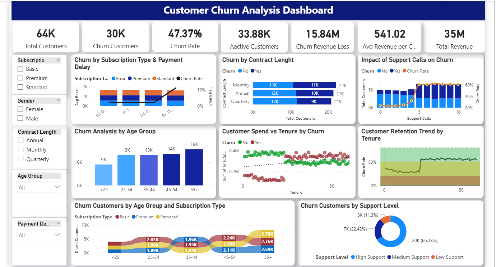

# Customer Churn Analysis Dashboard

## 📊 Project Overview
This repository contains an interactive **Power BI Dashboard** designed to analyze customer behavior, identify key churn drivers, and deliver actionable insights to improve business retention strategies.

---

## 📷 Dashboard Preview

---

## 💡 Key Business Insights & KPIs
Based on the analysis of **64K Total Customers**, the business is currently facing a **47.37% Churn Rate**, resulting in an estimated **$15.84M Churn Revenue Loss**. 

### 🔍 Crucial Findings:
* **Support Calls Impact:** A massive surge in customer churn is observed once support calls cross **5 calls**, indicating that poor issue resolution directly impacts retention.
* **Age Group:** The **55+ age group** shows the highest volume of churn (16K), making older demographics a high-risk segment.
* **Contract Length:** Customers on **Monthly contracts** churn significantly faster compared to Annual or Quarterly subscribers.
* **Payment Delay:** Churn rates spike dramatically when payment delays cross **8+ days**.

---

## 🛠️ Tools & Technologies Used
* **Data Visualization:** Power BI Desktop
* **Data Transformation:** Power Query (Data Cleaning & ETL)
* **Analytics:** KPI Metrics Tracking & Trend Analysis
